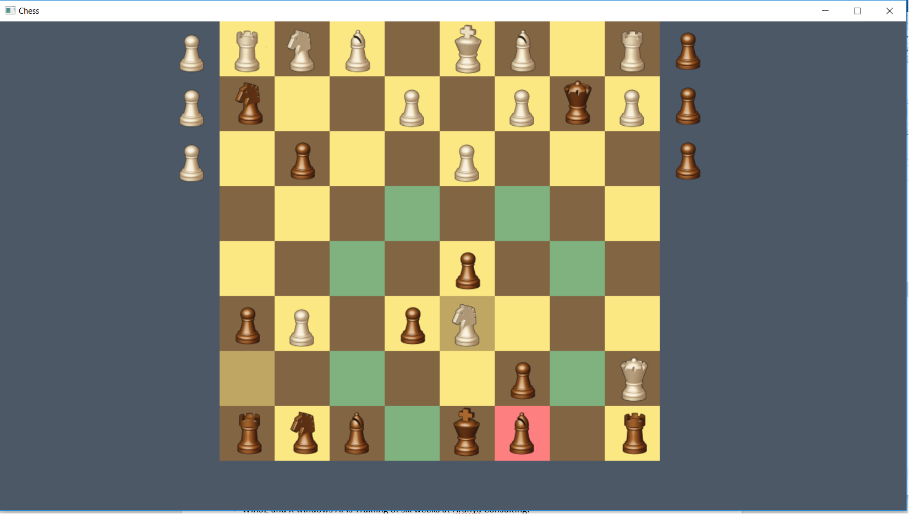

# Chess-2D
Chess-2D is 2D traditional game for two human players and be played offline for windows  operating system. It is written using the windows native api Win32 for the rendering of the bitmaps using C++ language.



## Prequisite
There is no external library needed, just the Windows Native APIs i.e. Win32 and C++ (with Visual Compiler) as it is made from scratch.

## Installation
There's no need to install the game. It is single executable file and can be played just click it.

## Building process
```sh
build.bat
```
